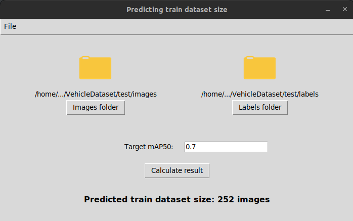

# Predicting-dataset-size
Predicting dataset size for neural network fine-tuning with a given quality in object detection task
## Usage
Run GUI version with <code>python main.py</code> command.  
Add your directories with images and labels and enter the target mAP value. Press <code>Calculate result</code> button for getting the answer.  
Please upload labels in YOLOv8 standard for single class. Each lines in labels should be in format <code>0 x_center y_center w h</code>.   

  
Terms of use can be found in the section <code>File -> Info</code> in the upper left corner of the application window.  
